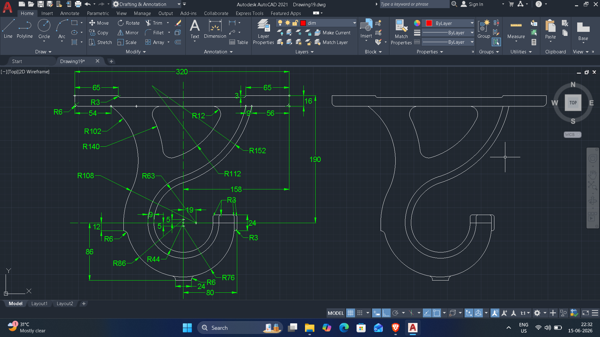
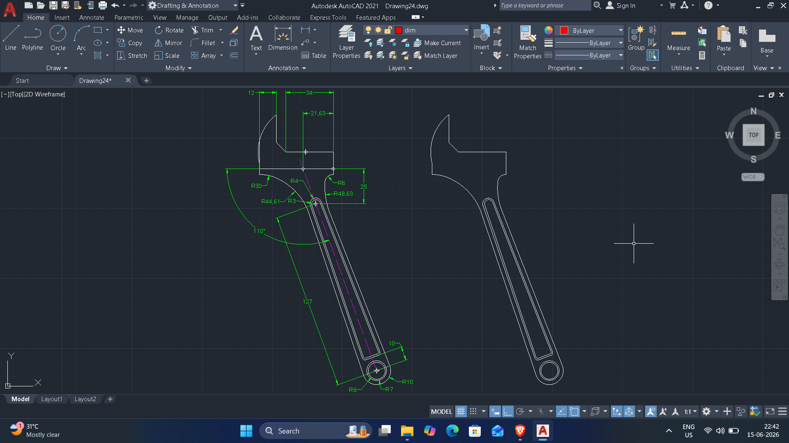
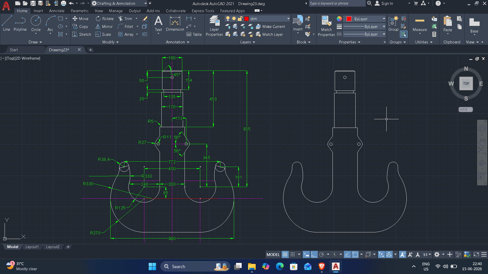
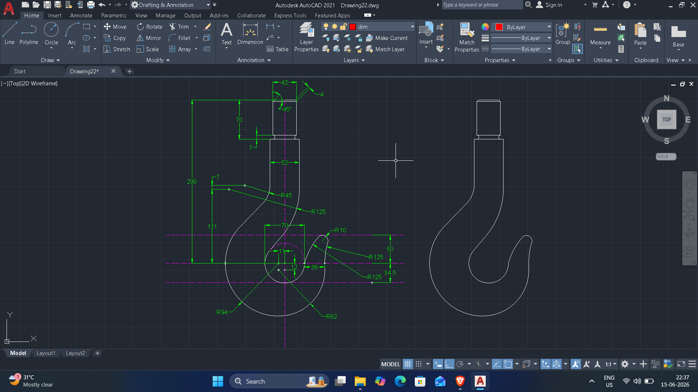
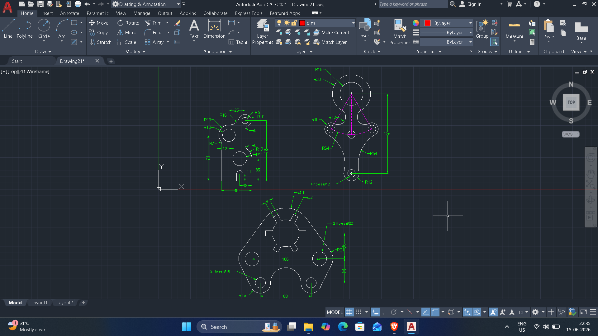
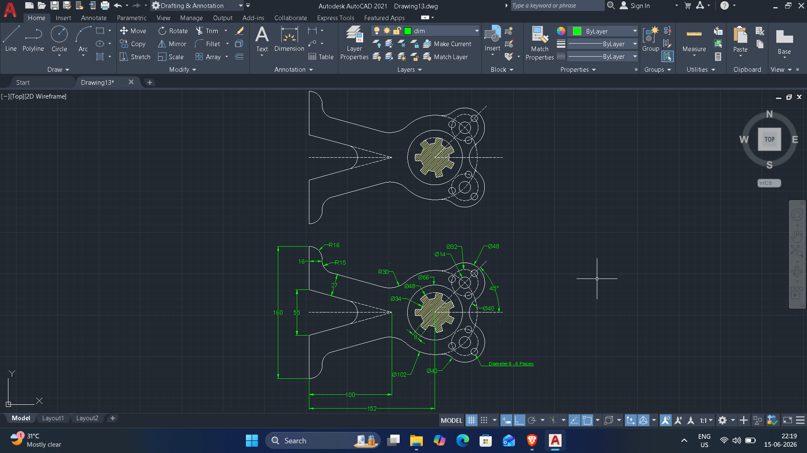
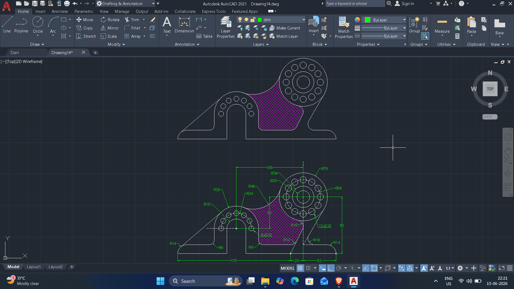
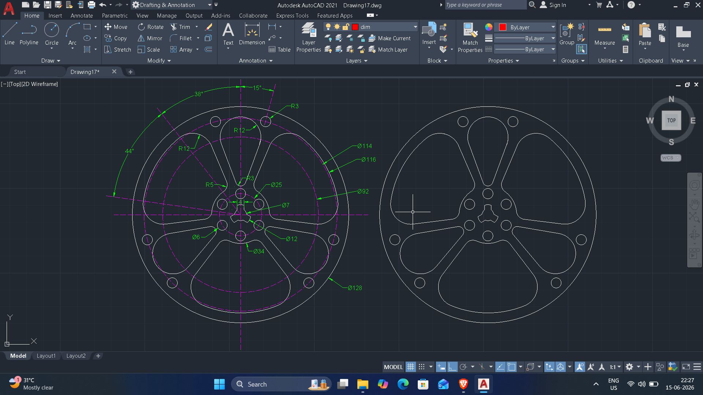
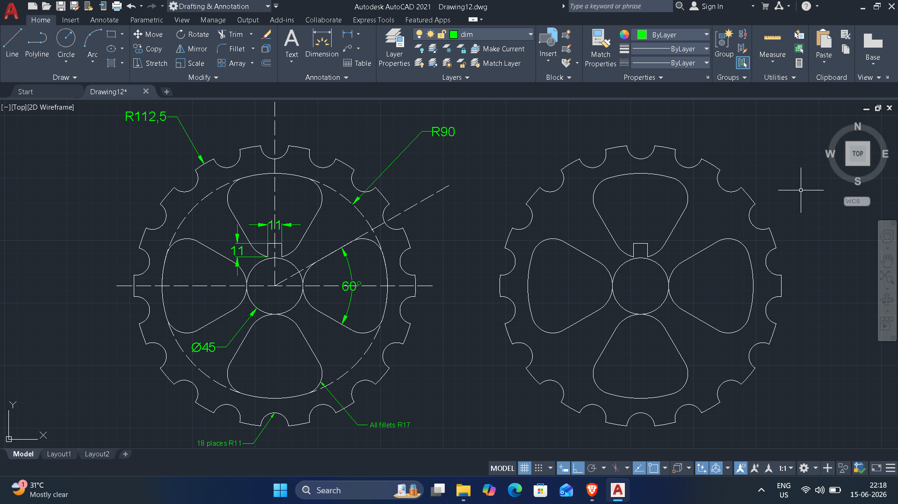
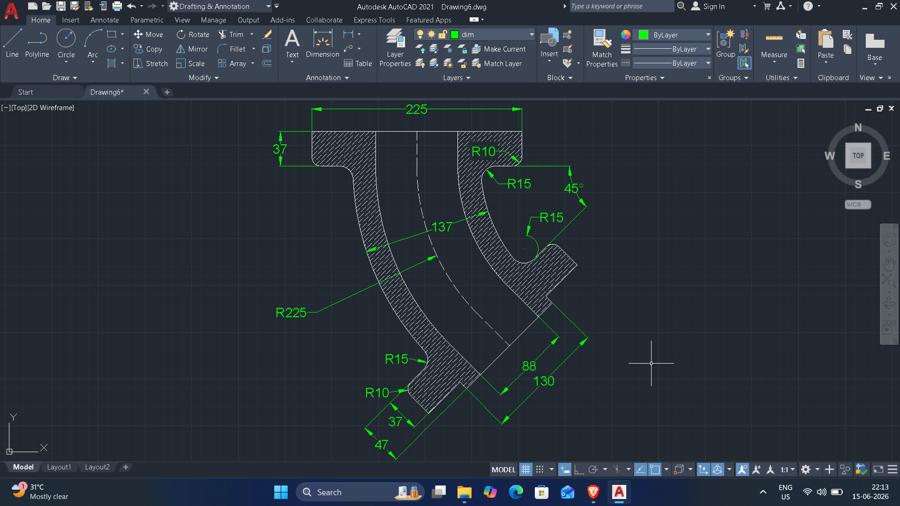

# Autocad-2D-files-cadbook-3
# Drawing 19

DWG file: Drawing19.dwg

# Drawing 24

DWG file: Drawing24.dwg

# Drawing 23

DWG file: Drawing23.dwg

# Drawing 22

DWG file: Drawin22.dwg

# Drawing 21

DWG file: Drawing21.dwg

# Drawing 13

DWG file: Drawing13.dwg

# Drawing 14

DWG file: Drawing14.dwg

# Drawing 17

DWG file: Drawing17.dwg

# Drawing 12

DWG file: Drawing12.dwg

# Drawing 6

DWG file: Drawing6.dwg
